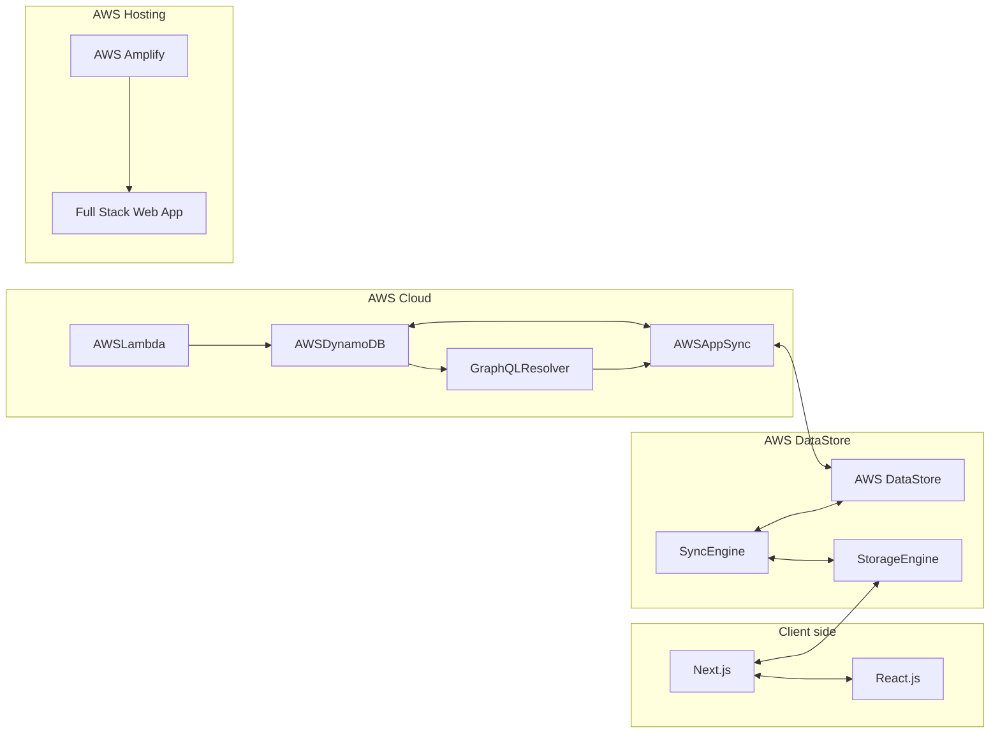

# Quote-Pulse
### 📝 Description:

- **Quote Pulse** is a full-stack web application that allows users to generate a random quote(s) from [Zen Quotes Api](https://zenquotes.io/) and save  generated quotes in **Image** format to your local machine.

### 💻 Technologies Used:

- **Frontend:** 
  - `React.js`, `React-Bootstrap`, `Styled-Components`, `Typescript`
- **Backend:**
  - `Node.js`, `Next.js`, `AWS-Amplify`, `AWS-DynamoDB`, `AWS AppSync` 
- **Deployment:**
  - `AWS-Lambda`
- **Version Control:**
  - `Git`, `GitHub`
- **Ci/CD pipeline:**
  - `AWS-Amplify`
- **API:**
  - [Zen Quotes Api](https://zenquotes.io/random)
   
    

### 🏗️ Project Architecture:

